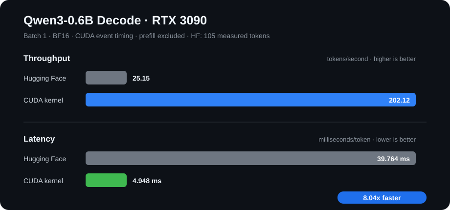

# Qwen3 CUDA Mega-Kernel

A cooperative CUDA mega-kernel for batch-one, single-token decoding with
[`Qwen/Qwen3-0.6B`](https://huggingface.co/Qwen/Qwen3-0.6B).

The test uses Hugging Face Transformers to prefill a chat-formatted prompt,
copies the resulting K/V cache into the kernel cache, and performs subsequent
token decoding with the custom CUDA kernel.

## Preliminary decode benchmark



| Decoder | Latency | Throughput |
|---|---:|---:|
| Hugging Face Transformers | 27.444 ms/token | 36.44 tokens/s |
| CUDA mega-kernel | 7.712 ms/token | 129.67 tokens/s |
| **CUDA speedup** | **3.56x** | **3.56x** |

Benchmark environment:

- GPU: NVIDIA GeForce RTX 3090
- Model: Qwen/Qwen3-0.6B in BF16
- Workload: batch-one autoregressive decode
- Maximum cache length: 512 tokens
- Hugging Face performs prompt prefill for both paths
- Decode calls are timed with CUDA events; model loading and prefill are excluded
- Kernel run: 95 measured decode tokens
- Hugging Face run: 105 measured decode tokens

This is an initial end-to-end decode comparison, not yet a controlled
microbenchmark. Each path generated greedily and their sequences eventually
diverged because of numerical differences, producing different measured token
counts. The CUDA timing also includes the binding's per-token `LayerWeights`
table allocation and copy.

## Run

Install CUDA-enabled PyTorch and Transformers, then run:

```bash
TORCH_CUDA_ARCH_LIST=8.6 MAX_JOBS=2 python3 model.py
```

The current launch configuration targets the RTX 3090 with 82 cooperative
blocks, one per streaming multiprocessor.

## Current inference flow

1. Apply the Qwen chat template.
2. Prefill the complete prompt with Hugging Face.
3. Copy each layer's K/V cache into `[28, 8, 512, 128]` BF16 buffers.
4. Decode new tokens with the cooperative CUDA kernel.
5. Compare CUDA-event latency and throughput with Hugging Face decode.

The next optimization is to keep the device `LayerWeights` table and scratch
buffers alive across tokens instead of allocating them inside every decode call.
